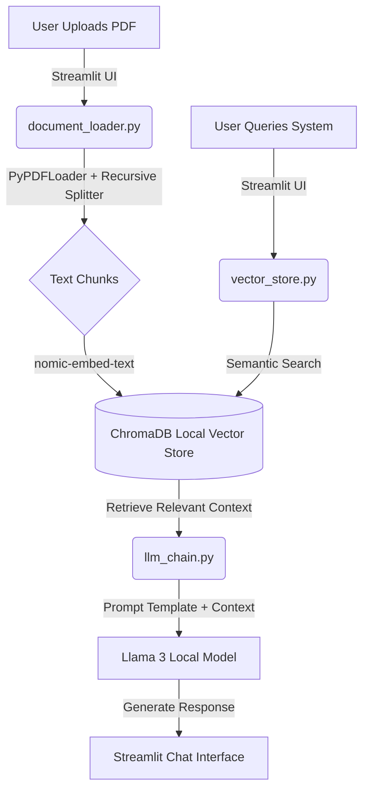

# Architect-Stream: Local RAG Technical Mentor

*A local, zero-hallucination RAG pipeline answering technical queries using Llama 3.*

An end-to-end Retrieval-Augmented Generation (RAG) application that acts as an automated technical mentor. Architect-Stream allows users to upload technical PDFs, intelligently parses the information, and enables interactive, context-aware "interviews" regarding the document's content—all running entirely locally without external API dependencies.

## Project Goals
1. **Interactive Document Analysis:** Transform static technical PDFs into dynamic, queryable knowledge bases.
2. **Zero Hallucination:** Ensure the language model grounds its responses *strictly* in the provided document context using rigorous prompt engineering.
3. **100% Local Execution (Privacy-First):** Prioritize data privacy and eliminate third-party API costs (like OpenAI) by orchestrating open-weights models locally via Ollama. No data ever leaves the host machine.
4. **Architectural Modularity:** Adhere strictly to the Single Responsibility Principle by separating ingestion, vector storage, and generation logic into a clean, maintainable backend structure decoupled from the frontend UI.

## Key Learnings & Competencies Demonstrated
Building this project solidified my understanding of modern AI/ML application architecture and production-ready Python practices, specifically:
* **Modern LangChain Ecosystem:** Implementing the latest modular LangChain architecture (`langchain-chroma`, `langchain-text-splitters`, `langchain-ollama`) rather than relying on deprecated monolithic packages.
* **Advanced Data Ingestion:** Managing token limits and context windows using `RecursiveCharacterTextSplitter` with calculated overlaps to preserve semantic meaning across page breaks.
* **Vector Database Management:** Implementing `ChromaDB` for persistent local vector storage and high-dimensional semantic search.
* **Dual-Model Local Orchestration:** Utilizing two separate local models simultaneously: a lightweight, mathematically optimized model for embeddings (`nomic-embed-text`) and a heavy-duty model for generative reasoning (`llama3`).
* **Robust File Pathing:** Designing cross-platform, dynamic absolute pathing (`os.path.abspath(__file__)`) to prevent relative directory crashes during terminal testing and UI execution.

## Technology Stack
* **Language:** Python 3.9+
* **Generative LLM:** Llama 3 (via local Ollama)
* **Embedding Model:** Nomic Embed Text (via local Ollama)
* **Framework:** LangChain Core & Community
* **Vector Database:** ChromaDB (`langchain-chroma`)
* **Data Ingestion & Processing:** PyPDFLoader, `langchain-text-splitters`
* **Frontend:** Streamlit

## System Architecture & Workflow



## Repository Structure
```

Architect-Stream/

├── app.py                   # Streamlit UI frontend

├── requirements.txt         # Python dependencies

├── src/                     # Backend module

│   ├── __init__.py

│   ├── document_loader.py   # PDF ingestion and chunking logic

│   ├── vector_store.py      # ChromaDB initialization and semantic search

│   └── llm_chain.py         # Llama 3 initialization and prompt engineering

├── chroma_db/               # (Ignored) Persistent local vector database

└── documents/                 # (Ignored) Temporary PDF storage
```

## Local Setup & Installation

### Prerequisites: Local AI Infrastructure
Because this project guarantees zero API costs and full offline capability, you must configure the local AI engine before running the Python code:

1. **Install Ollama:** Download and install the engine from [ollama.com/download](https://ollama.com/download).
2. **Pull the Required Models:** Open your terminal and pull both the embedding model and the generation model:
   ```bash
   ollama pull nomic-embed-text
   ollama pull llama3
   ```
3. **Verify the Engine is Running:** Ensure the Ollama application is active in your system tray/background.

### Step-by-Step Installation

**1. Clone the repository**
```bash
git clone [https://github.com/Md-Farmanul-Haque/architect_stream.git](https://github.com/Md-Farmanul-Haque/architect_stream.git)
cd Architect-Stream
```

**2. Create a virtual environment (Windows)**
```cmd
python -m venv venv
venv\Scripts\activate
```

**3. Install dependencies**
```cmd
pip install -r requirements.txt
```

## Usage

**1. Start the Streamlit Application**
Ensure your virtual environment is activated and Ollama is running, then execute:
```cmd
streamlit run app.py
```

**2. Interact**
* Open the local URL provided by Streamlit in your browser (usually `http://localhost:8501`).
* Upload a technical PDF using the sidebar.
* Wait for the system to process, embed, and store the document in the local vector database.
* Start asking context-aware questions in the chat interface!

## Future Enhancements
* **Multi-Document Support:** Update the ingestion pipeline to handle a directory of PDFs simultaneously.
* **Hybrid Search:** Implement BM25 alongside dense vector retrieval for improved accuracy on keyword-heavy technical queries.
* **Streaming Responses:** Enable real-time token streaming in the Streamlit UI to improve perceived latency.
```
